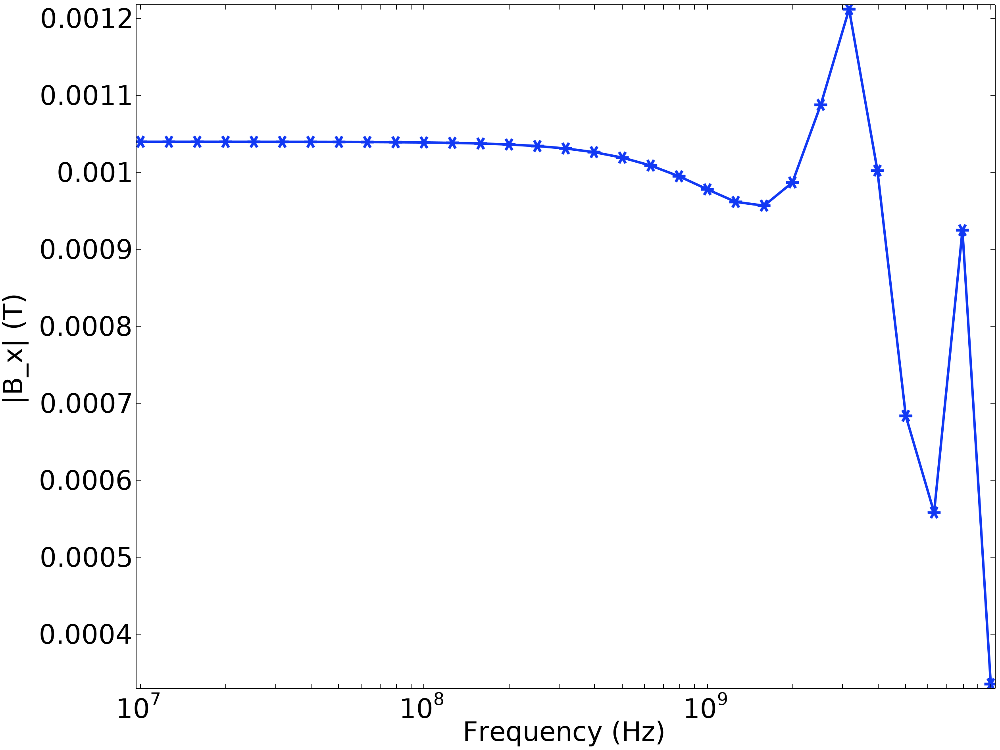

The tutorial setup shows how to make a simple sim.
I've made a more complicated simulation geometry and describing the results here.

The geometry is a tapered stripline design that looks like this:

At a frequency of 2.7 GHz, we get the magnetic field $B_x$ value
The side view is 

Zooming in near the microstrip, 

By the simulation this design gives a magnetic flux density of ~20 mT near the surface. 

So now we can examine the performance across a range of frequencies, 100 MHz - 10 GHz. 

To check the transmission characteristics we use the Scattering parameters $S_{11}$ and $S_{21}$ as a function of frequency. The $S_{21}$ is seen to be very flay and near 0 up till ~4-5 GHz above which it drops fast. Similarly we see $S_{11}$ being quite small till ~ 4-5 GHz. This suggests that the device is mostly good to use till around 4 GHz, which is precisely the frequency range we operate in.

Since our Quantum Mechanical spin flip operator is 
$$B_{MW} sin (\omega_{MW}t) \bold{S_X}$$

We should examine the average value of the magnetic field across the stripline as a function of the frequency. This will give us information about the field uniformity and give some idea of where to ideally position our sample for optimal spin control.

Plotting the value of the magnetic flux density $B_x$ across the length of the stripline, we get this

This tells us that in general, up to a frequency of 4-5 GHz the $B_x$ field is also stable. I would use this particular waveguide up to 5 GHz with confidence. 

As an aside, a simple way to ensure uniform $B_x$ across a large freuency range is to measure the Rabi frequency itself and tune the output power to get the same number. This kind of defeats the point of running this entire sim, but it is the main objective for a quantum sensing experiment anyhow.
