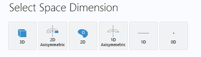
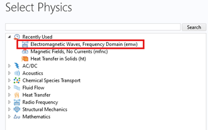
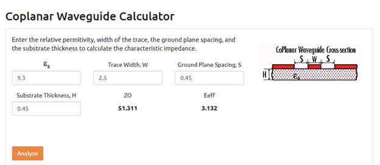

### Introduction
This is a simple tutorial to simulate the magnetic field and transmission characteristics of a microwave (MW) stripline waveguide for the purposes of quantum sensing experiments.

A (very) tiny bit of background first.
In Quantum Computing/ Sensing experiments, you manipulate the energy levels of electrons. To coherently drive electrons from one level to the other, you need precise control of the frequency and amplitude of the driving field. 
The typical Zeeman splitting between levels depends on the external magnetic field as 

$\Delta E = 2 g \mu_B B$

which turns out to be of the order of a few GHz for the external magnetic fields in our experiments (1-100 mT).
Since typically affordable hardware spans a bandwith of something like 1 MHz - 6 GHz, we work in that range. Going beyond 6 GHz is expensive and might put you on a list somewhere. 

The electron spin flip operator is given by

$B_{MW}$ $sin(\omega_{MW} t + \phi)$

Where $B_{MW}$ is the amplitude of the driving field. 
To consistently and efficiently drive the electrons you need a sort of flat MW amplitude across this grequency range.

### Step-by-step Tutorial

1. Open COMSOL, start a new project, choose "Model Wizard".

     
 

1. Double Click Electromagnetic Waves, Frequency Domain (emw) under Select Physics. 
    

1. Click study, then click Frequency Domain. 
    

1. This opens up an empty project. Now we define geometry. The rough parameters for the stripline to maintain a ~50Ω characteristic impedance are as follows: (Use the Coplanar Waveguide Calculator on https://www.microwaves101.com/calculators/864-coplanar-waveguide-calculator 
    