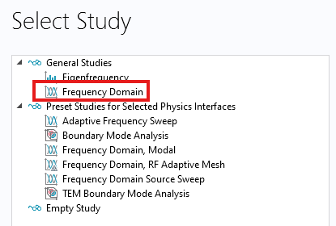
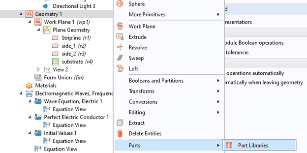
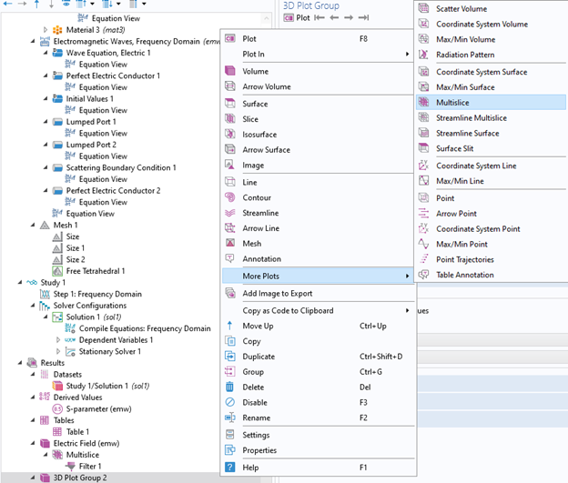

### Introduction
This is a simple tutorial to simulate the magnetic field and transmission characteristics of a microwave (MW) stripline waveguide for the purposes of quantum sensing experiments. 

A (very) tiny bit of background first.
In Quantum Computing/ Sensing experiments, you manipulate the energy levels of electrons. To coherently drive electrons from one level to the other, you need precise control of the frequency and amplitude of the driving field. 
The typical Zeeman splitting between levels depends on the external magnetic field as 

$\Delta E = 2 g \mu_B B$

which turns out to be of the order of a few GHz for the external magnetic fields in our experiments (1-100 mT).
Since typically affordable hardware spans a bandwith of something like 1 MHz - 6 GHz, we work in that range. Going beyond 6 GHz is expensive and might put you on a list somewhere. 

The electron spin flip operator is given by

$B_{MW}$ $sin(\omega_{MW} t + \phi)$

Where $B_{MW}$ is the amplitude of the driving field. 
To consistently and efficiently drive the electrons you need a sort of flat MW amplitude across this grequency range.

This particular one just defines the most simple geomerty, a straight stripline with two SMA ports connectors. This is just to set up the problem and the basic simulation.
In actual experiment, we use a tapered microstrip in the path. That delivers a large oscillating magnetic field that helps in the experiment.

### Step-by-step Tutorial

1. Open COMSOL, start a new project, choose "Model Wizard".

     

1. Double Click Electromagnetic Waves, Frequency Domain (emw) under Select Physics.

    

1. Click study, then click Frequency Domain. 

    

1. This opens up an empty project. Now we define geometry. The rule of thumb is for the stripline to maintain a ~50Ω characteristic impedance are as follows: (Use the Coplanar Waveguide Calculator on https://www.microwaves101.com/calculators/864-coplanar-waveguide-calculator 

    

1.	Write the following parameters into the parameters table. These will specify the geometry.

    

1.	Right click Geometry-> Work Plane. The click build selected with default values.  	

    

1. Right click Plane Geometry -> Rectangle. 

    
1.	Make the rectangle to denote the stripline. Make sure to center the base under Position. 

    

1.	Repeat this process to implement the right and left side gold patches. Need to specify center offsets properly. Also define a rectangle encompassing the full substrate. This will be needed to define the solid block of substrate later.
    
    

1.	The 2D geometry should now look like this: 

    

1.	Now add the sma connector. Right click Geometry-> Parts -> Part Libraries

    

1.	Find the SMA connector under RF Module -> Connectors. Double click to add. Add total of 2 connectors to the geometry (for input and output).

    

1.	The part is loaded from library. Only change orientation and position. Do not change any other properties. Click Build Selected.

     

1.	Repeat the same for the other connector.
    
    

1.	Now define 2 boxes under Geometry -> Block. One will be the air volume encompassing the entire object, the other sapphire substrate block.

    
    

1.	Click Form Union -> Build Selected. This finalizes the geometry. 

1.	Now add materials: Air, Gold, Sapphire. Right Click Materials -> Add Material from Library. Search Air, use Built-in -> Air. 

    

1.	We will add Sapphire as a blank material because it is not available in the standard catalog. Right Click Materials -> Blank material. Name it Sapphire. Select Electromagnetic Models -> dielectric Losses. Input this screenshot values.
    

1. Right Click Electromagnetic Waves, Frequency Domain (emw) -> Perfect Electric Conductor.
    
    

1.	This creates a Perfect Electric Conductor 2. Select all the metal faces and the surfaces of the SMA Connectors. This is what we use instead of defining Gold as a material (Au is a good conductor anyway).

    
    
1.	Right Click Electromagnetic Waves, Frequency Domain (emw) ->  lumped port. This will be used for MW excitation. Add one more port for collection. 

    

1.	In Lumped Port 1, select the circle of the SMA port where input will be applied. Do the same thing for Lumped port 2. For type Use Coaxial.

    
    

1.	Right Click Electromagnetic Waves, Frequency Domain -> Scattering Boundary Condition. Select the 6 faces of the air block. 
     
    

1.	Go to Mesh 1 -> Build All

     

1.	Go to Study 1 -> Step 1: Frequency Domain. Type the correct Frequency (2.7 GHz here).  Click Compute.

    

1.	You get the results… 

    

1.	This above figure only shows the electric field distribution. For working with spin defects  we want to see and optimize magnetic field distribution. Right Click Results -> 3D Plot Group. 

    

1.	In the plot group Right Click -> More Plots -> Multislice.

    

1.	In the multilice settings change the expression to emw.normB, click Plot. 

    

As another example, here’s a picture of a thin stripline waveguide, optimizing the near surface magnetic field norm $|B|$.

